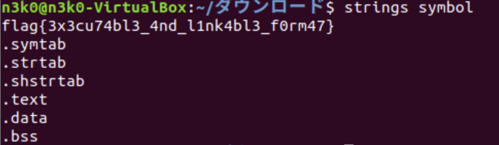

# CTF4Girls 2019/12/07 Write Up

クイズ形式CTFでCrypto,Binary,Web,Forensic,Networkの計5ジャンルからそれぞれ3問ずつ出題された.
筆者は初参戦で,問題を全てダウンロードし損ねてしまった...orz
flagの形式はflag{...}.

因みに,参戦環境は以下となっている.

- Ubuntu (64bit)
- Windows 10 (64bit)
- Kali-Linux Debian (32bit)

他の参戦者は,UbuntuとKaliが多かった気がする.

## Binary
### symbol(100)

- stringsコマンドでflagが出てくる.

## Crypto
### solfa music 

- solfa cipherを用いた暗号の問題.
- 楽譜のコードの暗号文を復元した文がflagとなっている.
- 個人的に一番好きな問題

問題画像(solfa_music)

復元・暗号化の表

上の楽譜のコードに上の表を使って,復元を行うとflagが得られる.

T  H    E    F   L    A   G    I    S   C   T   F   G    I    R   L   S   M   U  S  I    C  
D1 M3 S1 D4 L3 M1 M4 R1 F1 R3 D1 D4 M4 R1 D3 L3 F1 F3 T3 F1 R1 R3  
下記のサイトが本問題を解く上で,とても参考になった.

- 'Solfa Cipher Secrets'
https://www.wmich.edu/mus-theo/solfa-cipher/secrets/

### 
