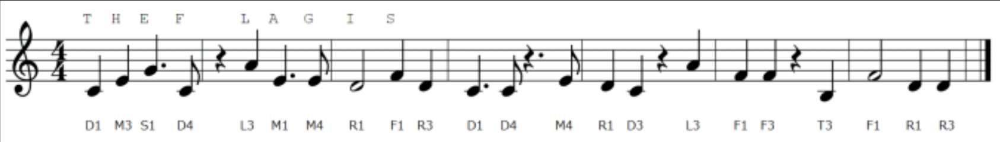
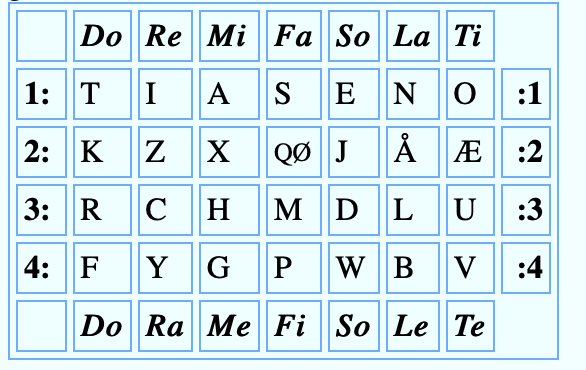

# CTF4Girls 2019/12/07 Write Up(と言う名の復習)

クイズ形式CTFでCrypto,Binary,Web,Forensic,Networkの計5ジャンルからそれぞれ3問ずつ出題された.
筆者は初参戦で,問題を全てダウンロードし損ねてしまった...orz
問題の名前も曖昧なので,問題名も違う気がする
flagの形式はflag{...}.
WebとNetwork以外の問題を振り返ってみる.

因みに,参戦環境は以下となっている.

- Ubuntu (64bit)
- Windows 10 (64bit)
- Kali-Linux Debian (32bit)

他の参戦者は,UbuntuとKaliが多かった気がする.

## Binary
### symbol(100)

- stringsコマンドでflagが出てくる.

```
$ strings symbol
flag{3x3cu74bl3_4nd_l1nk4bl3_f0rm47}
.symtab
.strtab
.shstrtab
.text
.data
.bss
```
## hidden message(300)
- file形式
```
hidden_message.exe: PE32 executable (GUI) Intel 80386, for MS Windows
```

- OllydbgとIDAでファイルを開いてみる


- main関数の前に
breakpointを設定して,ひたすらF8でステップ実行すると,,,,


## Crypto

### 名前忘れた(100)

- rail fence cipherを用いた暗号の問題
- 暗号化したflagが渡され,rail fence cipherを使って暗号文を復元させる問題
```
f{zc3lgz64_1hra16p}
```
Rail fence cipherで復元すると,
flag{z16z46_c1ph3r}
でflagが取れた.

### solfa music(200) 

- solfa cipherを用いた暗号の問題.
- 楽譜のコードの暗号文を復元した文がflagとなっている.
- 個人的に一番好きな問題

問題画像(solfa_music)



復元・暗号化の表



上の楽譜のコードに上の表を使って,復元を行うとflagが得られる.

T  H    E    F   L    A   G    I    S   C   T   F   G    I    R   L   S   M   U  S  I    C </br>
D1 M3 S1 D4 L3 M1 M4 R1 F1 R3 D1 D4 M4 R1 D3 L3 F1 F3 T3 F1 R1 R3 </br >
下記のサイトが本問題を解く上で,とても参考になった.

- 'Solfa Cipher Secrets'
https://www.wmich.edu/mus-theo/solfa-cipher/secrets/

# Network

### Transfer(100)

- strings Transfer.pcapngでflagが得られる.

```
$ strings Transfer.pcapng
flag{W1nI0-FtP}
```

### 

